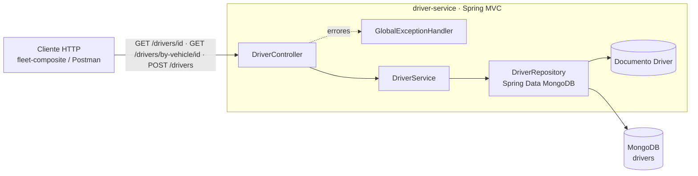
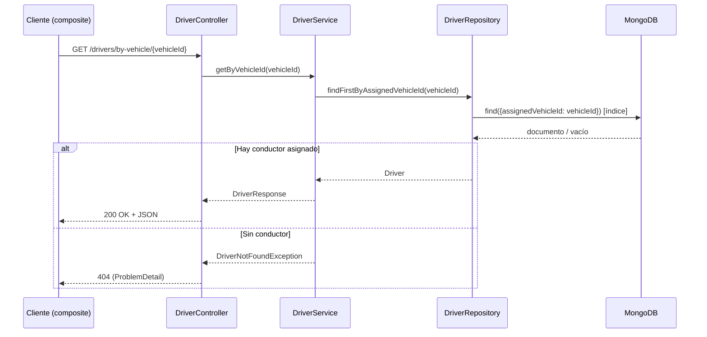

# driver-service: arquitectura

## Diagrama de componentes

```mermaid
flowchart LR
    CL[Cliente HTTP<br/>fleet-composite / Postman]
    subgraph DS[driver-service · Spring MVC]
        C[DriverController]
        EH[GlobalExceptionHandler]
        S[DriverService]
        R[DriverRepository<br/>Spring Data MongoDB]
        M[(Documento Driver)]
        C --> S --> R --> M
        C -. errores .-> EH
    end
    DB[(MongoDB<br/>drivers)]
    CL -->|GET /drivers/id · GET /drivers/by-vehicle/id · POST /drivers| C
    R --> DB
```

## Diagrama de secuencia: GET /drivers/by-vehicle/{vehicleId}

```mermaid
sequenceDiagram
    participant Cli as Cliente (composite)
    participant C as DriverController
    participant S as DriverService
    participant R as DriverRepository
    participant DB as MongoDB

    Cli->>C: GET /drivers/by-vehicle/{vehicleId}
    C->>S: getByVehicleId(vehicleId)
    S->>R: findFirstByAssignedVehicleId(vehicleId)
    R->>DB: find({assignedVehicleId: vehicleId}) [índice]
    DB-->>R: documento / vacío
    alt Hay conductor asignado
        R-->>S: Driver
        S-->>C: DriverResponse
        C-->>Cli: 200 OK + JSON
    else Sin conductor
        S-->>C: DriverNotFoundException
        C-->>Cli: 404 (ProblemDetail)
    end
```
