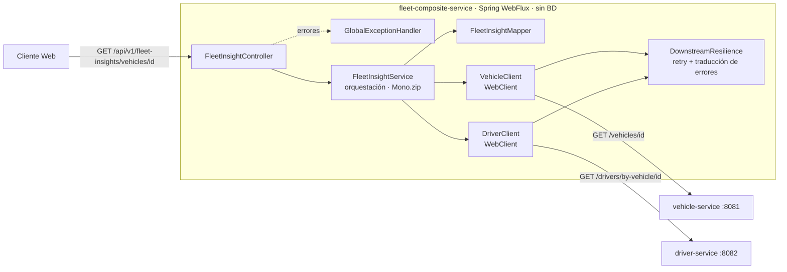
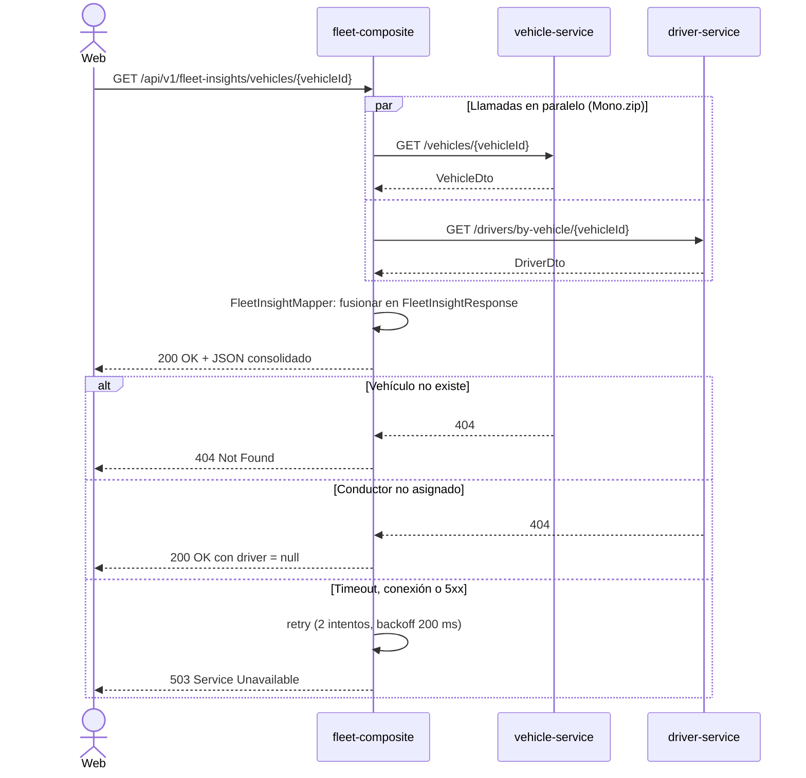

# fleet-composite-service: arquitectura

## Diagrama de componentes

```mermaid
flowchart LR
    W[Cliente Web]
    subgraph FC[fleet-composite-service · Spring WebFlux · sin BD]
        C[FleetInsightController]
        EH[GlobalExceptionHandler]
        S[FleetInsightService<br/>orquestación · Mono.zip]
        MP[FleetInsightMapper]
        VC[VehicleClient<br/>WebClient]
        DC[DriverClient<br/>WebClient]
        RS[DownstreamResilience<br/>retry + traducción de errores]
        C --> S
        S --> VC
        S --> DC
        S --> MP
        VC --> RS
        DC --> RS
        C -. errores .-> EH
    end
    VS[vehicle-service :8081]
    DS[driver-service :8082]
    W -->|GET /api/v1/fleet-insights/vehicles/id| C
    VC -->|GET /vehicles/id| VS
    DC -->|GET /drivers/by-vehicle/id| DS
```

## Diagrama de secuencia: camino feliz y errores

```mermaid
sequenceDiagram
    actor Web
    participant FC as fleet-composite
    participant VS as vehicle-service
    participant DS as driver-service

    Web->>FC: GET /api/v1/fleet-insights/vehicles/{vehicleId}

    par Llamadas en paralelo (Mono.zip)
        FC->>VS: GET /vehicles/{vehicleId}
        VS-->>FC: VehicleDto
    and
        FC->>DS: GET /drivers/by-vehicle/{vehicleId}
        DS-->>FC: DriverDto
    end

    FC->>FC: FleetInsightMapper: fusionar en FleetInsightResponse
    FC-->>Web: 200 OK + JSON consolidado

    alt Vehículo no existe
        VS-->>FC: 404
        FC-->>Web: 404 Not Found
    else Conductor no asignado
        DS-->>FC: 404
        FC-->>Web: 200 OK con driver = null
    else Timeout, conexión o 5xx
        FC->>FC: retry (2 intentos, backoff 200 ms)
        FC-->>Web: 503 Service Unavailable
    end
```
