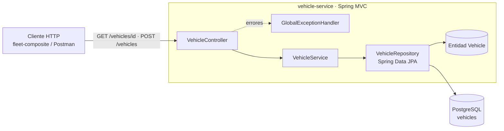
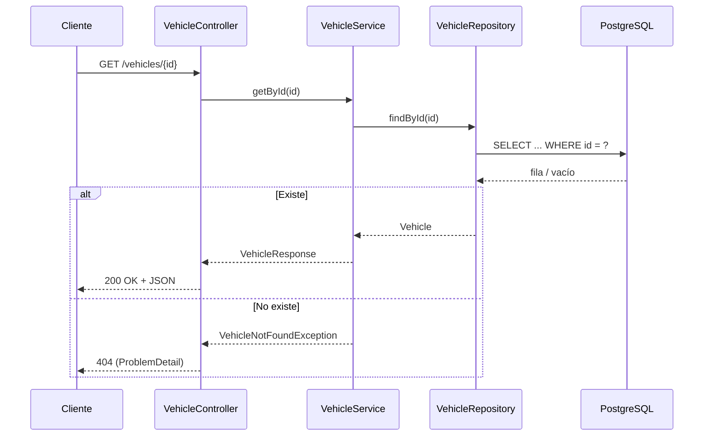

# vehicle-service: arquitectura

## Diagrama de componentes

```mermaid
flowchart LR
    CL[Cliente HTTP<br/>fleet-composite / Postman]
    subgraph VS[vehicle-service · Spring MVC]
        C[VehicleController]
        EH[GlobalExceptionHandler]
        S[VehicleService]
        R[VehicleRepository<br/>Spring Data JPA]
        M[(Entidad Vehicle)]
        C --> S --> R --> M
        C -. errores .-> EH
    end
    DB[(PostgreSQL<br/>vehicles)]
    CL -->|GET /vehicles/id · POST /vehicles| C
    R --> DB
```

## Diagrama de secuencia: GET /vehicles/{id}

```mermaid
sequenceDiagram
    participant Cli as Cliente
    participant C as VehicleController
    participant S as VehicleService
    participant R as VehicleRepository
    participant DB as PostgreSQL

    Cli->>C: GET /vehicles/{id}
    C->>S: getById(id)
    S->>R: findById(id)
    R->>DB: SELECT ... WHERE id = ?
    DB-->>R: fila / vacío
    alt Existe
        R-->>S: Vehicle
        S-->>C: VehicleResponse
        C-->>Cli: 200 OK + JSON
    else No existe
        S-->>C: VehicleNotFoundException
        C-->>Cli: 404 (ProblemDetail)
    end
```
